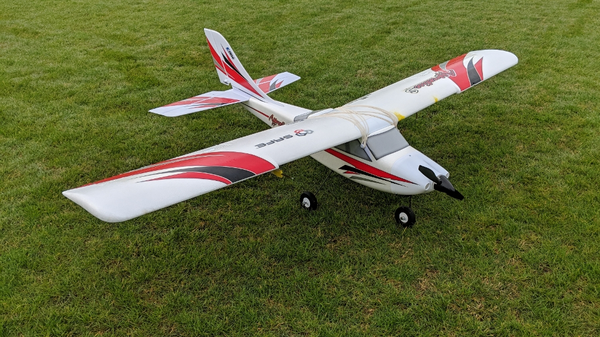
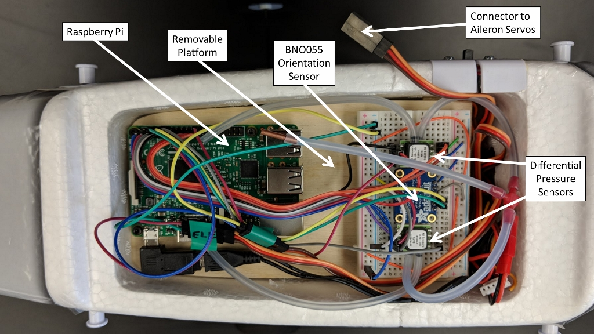
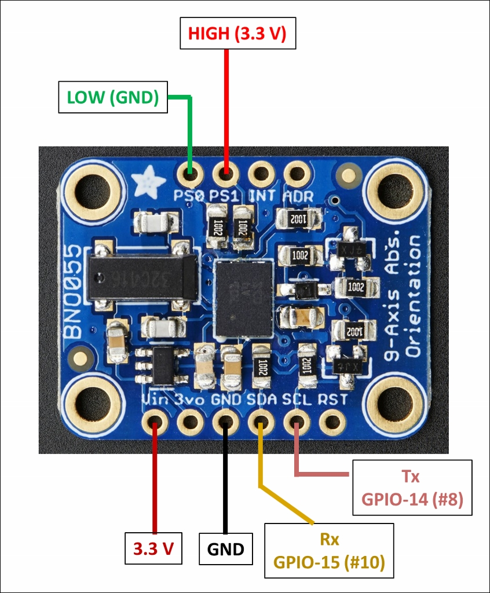
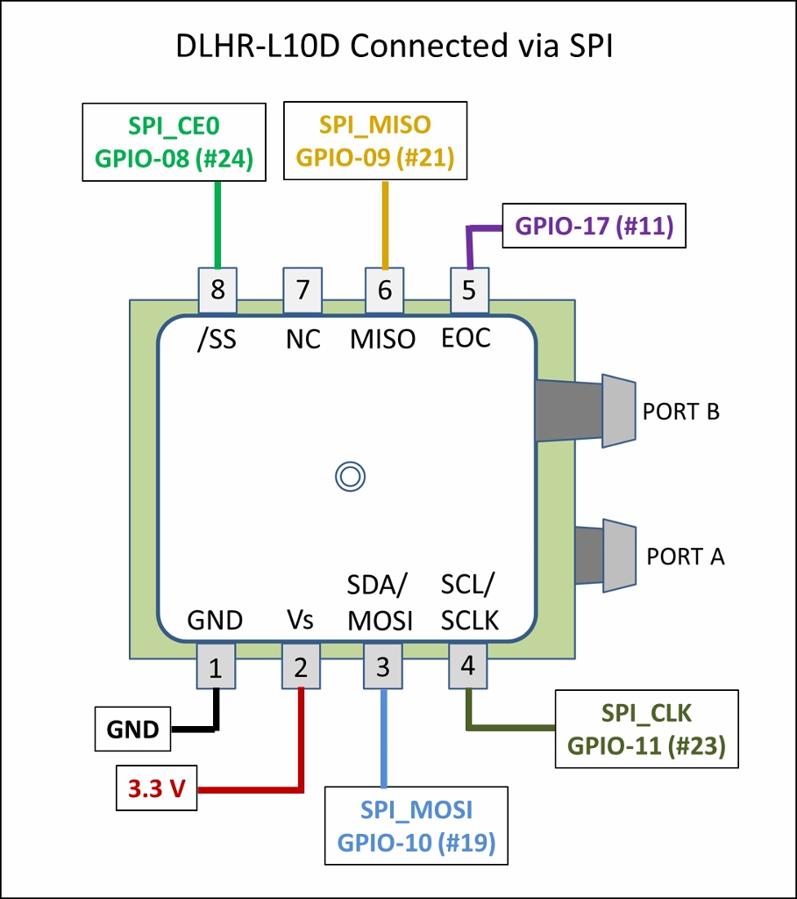
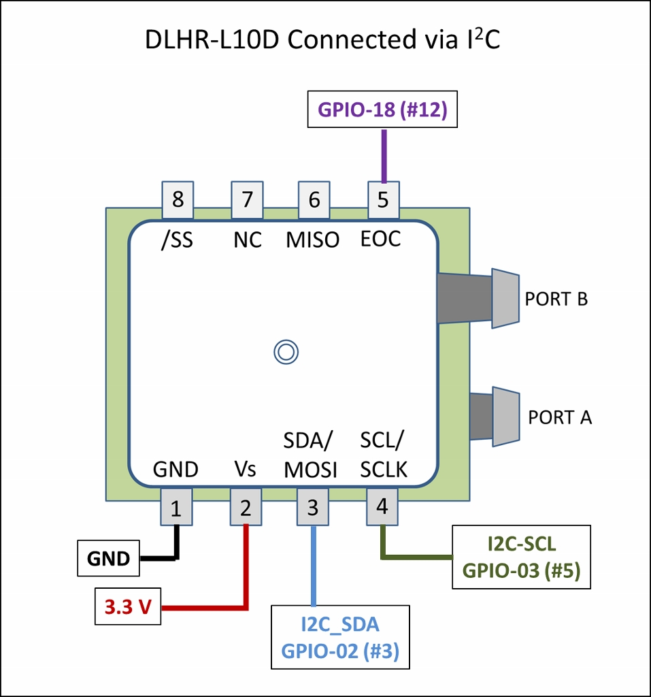
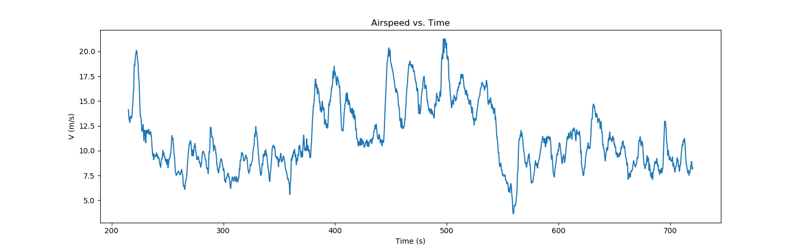
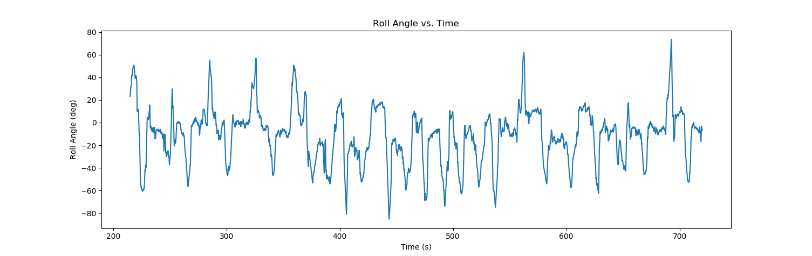
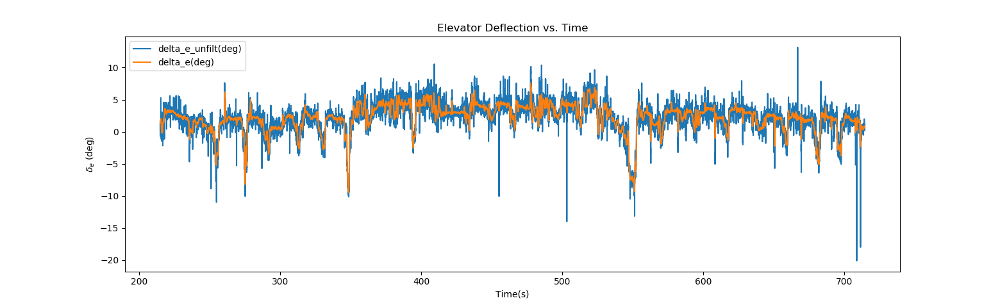

# Flight Data Collection System

<a href="https://madewitt.com/2019/02/13/flight-data-collection-system/" target="_blank"></a>

This repository hosts code used in a flight data collection system developed for a
radio-controlled aircraft. This includes code used to collect data, as well as code used
to process, filter, and visualize the data. 
<a href="https://madewitt.com/2019/02/13/flight-data-collection-system/" target"_blank">Click here</a>
for more details about the project.


## What data are collected?


A Raspberry Pi 2 is used as an onboard computer. The aircraft's roll, pitch, and heading are measured with
an Adafruit BNO055 orientation sensor. Airspeed and angle of attack are measured by a
system of two pitot-static tubes connected to differential pressure sensors. One pitot-static
tube is mounted under the right wing facing toward the front of the aircraft, while the other
is mounted under the left wing and is tilted downward at an 80 degree angle. Elevator deflection
and throttle setting are measured by connecting the PWM outputs of aircraft's radio receiver
to GPIO pins on the Pi. Using interrupts, the rising and falling edges of the PWM signal are
recorded so that the PWM signal can be reconstructed. Descriptions and derivations of the
calibration functions used to convert raw data into final values can be found in the
<a href="https://madewitt.com/2019/02/13/flight-data-collection-system/" target"_blank">project
writeup</a>.


## Summary of the Code
Data collection code is written in C and is used by the Raspberry Pi 2
to interact with sensors and log data. Python code for processing the collected data and
creating plots uses `pandas` to read in and manipulate data, `scipy` to filter noise
and perform numerical root finding, and `matplotlib` to generate plots. The files in
the repository include:

### C Code for Data Collection
- `collection/main.c`
	- Initialize and calibrate sensors, setup interrupts, poll orientation sensor, and write data
	  to CSV files.
- `collection/FlightSensors.c` and `collection/FlightSensors.h`
	- Contains functions and interrupt service routines used to communicate with sensors.
	  
### Python Code for Data Processing and Visualiztion
Three separate Python scripts located in the `processing` folder read in data, process it as
necessary, and generate plots. Sample data is also included in this folder so that the
scripts may be run.
- `processing/AirspeedAndAOA.py`
	- Smooth out noise in the differential pressure data using a Savitzky-Golay filter.
	- Compute airspeed and angle of attack from calibration functions.
	- Generate plots of Airspeed vs. Time and Angle of Attack vs. Time. 
- `processing/Orientation.py`
	- Correct pitch angle.
	- Generate plots of Roll vs. Time, Pitch vs. Time, and Heading vs. Time.
- `processing/Controls.py`
	- Compute the "ON TIME" of the PWM signal from rising edge and falling edge times.
	- Smooth out noise in "ON TIME" using a Savitzky-Golay filter.
	- Compute elevator deflection angle and static thrust from PWM "ON TIME."
	- Generate plots of Elevator Deflection vs. Time and Static Thrust vs. Time.


## Raspberry Pi 2 Connections
The data collection code assumes that the sensors are connected to the 
Raspberry Pi 2 pins as follows:
### Adafruit BNO055 Absolute Orientation Sensor via UART


- Use 3.3 V for power.
- Must set `PS0` pin to `LOW` and `PS1` pin to `HIGH` on the BNO055 to select UART mode.
- In UART Mode the `SDA` pin becomes the transmit `Tx` pin and the `SCL` pin becomes
the receive `Rx` pin.
- Connect the `Tx` (`SDA`) pin on the sensor to the `Rx` pin on the Raspberry
Pi 2 and connect the `Rx` (`SCL`) pin on the sensor to the `Tx` pin on the Raspberry Pi 2.

### DLHR-L10D Differential Pressure Sensors via SPI and I<sup>2</sup>C


- SPI
	- Use 3.3 V for power.
	- While there is only one SPI bus on the Raspberry Pi 2, there are two chip enable
	pins `SPI_CE0` and `SPI_CE1`. Connect the pressure sensor's `SS` pin to the
	Raspberry Pi's `SPI_CE0` pin (GPIO-08, #24). 
	- Connect the pressure sensor's `EOC` interrupt pin to GPIO-17 (#11) on the Raspberry Pi.
	- Connect the remainder of the SPI pins (MISO, MOSI, SCLK) to their corresponding
	pins on the Pi.




- I<sup>2</sup>C
	- Use 3.3 V for power. 
	- Connect the pressure sensor's `EOC` interrupt pin to GPIO-18 (#12) on the Raspberry Pi 2.
	- Connect the remainder of the I<sup>2</sup>C pins (SDA, SCL) to their
	  corresponding pins on the Pi.

### The Aircraft's Radio Receiver
For each channel, the aircraft radio receiver has three pins: ground, power, and PWM signal.
Only the ground and PWM signal pins should be connected to the Raspberry Pi 2. <b>DO NOT</b> connect the power
pins to the Pi. The PWM signals are treated as an interrupts and are connected as follows.
- Elevator PWM signal from receiver connected to GPIO-27 (#13).
- Throttle PWM signal from receiver connected to GPIO-22 (#15).
- Remember to connect the `GND` for each receiver channel to the `GND` of the Pi.


## Compiling and Running the Data Collection Code
The data collection code uses the [WiringPi library](http://wiringpi.com/).
WiringPi is now pre-installed on standard Raspbian systems. The pin
numbers referenced in the code are
[WiringPi pin numbers](http://wiringpi.com/pins/), not the
standard Raspberry Pi 2 pin numbers.

1. Follow the directions
[here](http://wiringpi.com/download-and-install/) to make sure WiringPi is pre-installed.
If not, follow directions to download and install.
2. In the `collection` folder, compile `main.c`, making sure to link the wiringPi
library. For example:
```
gcc -Wall main.c -lwiringPi
```
3. Make sure the aircraft is on a level surface and execute the code: `./a.out`
4. Each time the data collection code is run, the sensors (accelerometer, gyro, magnetometer) on the
BNO055 orientation sensor must be calibrated. This process begins automatically when the code is run,
and you should see continuously updated messages on the screen such as "MAGNETOMETER not fully
calibrated" and "ACCELEROMETER not fully calibrated." The user must put the aircraft in various
orientations to assist in completing the calibration process. Repeat the following steps
until the calibration is complete.
	- Leave the aircraft still on a level surface for several seconds.
	- Orient the aircraft such that the nose points forward and the right wing points downward and
 hold still for 3 to 4 seconds.
	- Orient the aircraft such that the nose points forward and the top of the
 aircraft points downward and hold still for 3 to 4 seconds.
	- Orient the aircraft such that the nose points forward and the left wing
 points downward and hold still for 3 to 4 seconds.
	- Orient the aircraft such that the nose points upward and hold for 3 to 4 seconds.
	- Orient the aircraft such that the nose points downward and hold for 3 to 4 seconds.
	- Repeat these steps until the calibration is complete. 
5. When the calibration is complete, you should see the message "Successful calibration of all
BNO055 Orientation Sensor components." The code will then begin collecting measurements.

## Output of the Data Collection Code
The output of the data collection code is the following set of CSV files:
1. `dp1data.csv` contains two columns: `time(s)` and `dP1(Pa)`. dP1 is the differential pressure
in Pascals (Pa) recorded by the pressure sensor connected via SPI.
2. `dp2data.csv` contains two columns: `time(s)` and `dP2(Pa)`. dP2 is the differential pressure
in Pascals (Pa) recorded by the pressure sensor connected via I<sup>2</sup>C.
3. `imudata.csv` contains four columns: `time(s)`, `heading(deg)`, `roll(deg)`, and `pitch(deg)`.
Heading corresponds to the magnetic compass heading in degrees (0/360 North, 90 East, 180 
South, 270 West). A right bank is a positive roll, and a
left bank is a negative roll. Because of the way the BNO055 was installed, zero pitch is
recorded as 180 degrees. The Python data processing code corrects for this.
4. `elevatordata.csv` contains one column, `time(s)`. The times recorded are for both the
rising edge and falling edge of the PWM signal sent to the elevator servo.
5. `throttledata.csv` contains one column, `time(s)`. The times recorded are for both the
rising edge and falling edge of the PWM signal sent to the electronic speed controller.
6. `spierrors.csv` contains three columns: `time(s)`, `read_error`, `request_error`. The two
error columns will contain 0 if there was no error, and 1 if an error occurred.
7. `i2cerrors.csv` contains three columns: `time(s)`, `read_error`, `request_error`. The two
error columns will contain 0 if there was no error, and 1 if an error occurred.
8. `uarterrors.csv` contains one column, `error_msg`. Error codes collected in the UART error
log are written as text messages.
	
## Processing the Collected Data
The following sample data files are included in the `processing` folder:
- `processing/sample_data/imudata.csv` : from a test flight
- `processing/sample_data/elevatordata.csv` : from a test flight
- `processing/sample_data/throttledata.csv` : from a test flight
- `processing/sample_data/flight_data/dp1data.csv` : from a test flight
- `processing/sample_data/flight_data/dp2data.csv` : from a test flight
- `processing/sample_data/background/dp1data.csv` : background readings taken indoors 
- `processing/sample_data/background/dp2data.csv` : background readings taken indoors

Background differential pressure sensor data was taken by running the data collection code while
the aircraft was indoors to ensure that there would be no airflow over the pitot-static tubes.
`AirspeedAndAOA.py` averages the background values and subtracts the average background from
the pressure data taken while in flight. All three Python scripts can be run from within the
`processing` folder.
```
python AirspeedAndAOA.py
python Orientation.py
python Controls.py
```
A few sample plots are given below.

#### Airspeed vs. Time


---

#### Roll Angle vs. Time


---

#### Elevator Deflection vs. Time

